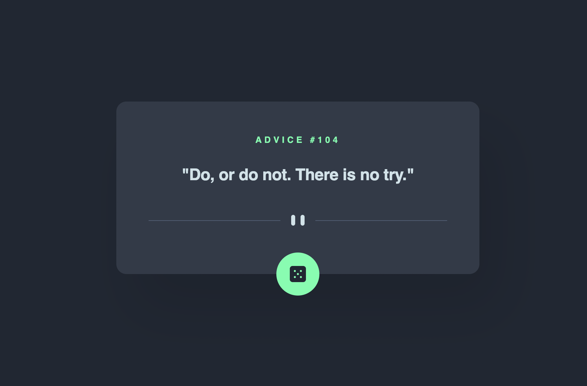

# Frontend Mentor - Advice generator app solution

This is a solution to the [Advice generator app challenge on Frontend Mentor](https://www.frontendmentor.io/challenges/advice-generator-app-QdUG-13db). Frontend Mentor challenges help you improve your coding skills by building realistic projects.

## Table of contents

- [Overview](#overview)
  - [Screenshot](#screenshot)
  - [Links](#links)
- [My process](#my-process)
  - [Built with](#built-with)
  - [What I learned](#what-i-learned)
  - [Continued development](#continued-development)
  - [Useful resources](#useful-resources)
- [Author](#author)

## Overview
The challenge was to build out this advice generator app using the Advice Slip API and get it looking as close to the design as possible.

Users should be able to:

- View the optimal layout for the app depending on their device's screen size
- See hover states for all interactive elements on the page
- Generate a new piece of advice by clicking the dice icon

### Screenshot



### Links

- Solution URL: [https://www.frontendmentor.io/solutions/advice-generator-app-YuFolNA3Yo](https://www.frontendmentor.io/solutions/advice-generator-app-YuFolNA3Yo)
- Live Site URL: [https://chris-nowicki.github.io/advice-generator-app/](https://chris-nowicki.github.io/advice-generator-app/)
- Advice Slip API: [https://api.adviceslip.com/](https://api.adviceslip.com/)

## My process

For this challenge I started with the HTML code and then styled with CSS from the top down using dummy data (the example from the challenge files).  Once I got the advice generator card to look
the way I wanted I coded in the Javascript to connect with the [Advice Slip API](https://api.adviceslip.com/).

### Built with

- Semantic HTML5 markup
- CSS custom properties
- Flexbox
- Javascript

### What I learned

I learned more about the `transform: translateY(50%);` in my css properties to get the dice icon exactly where I wanted it.  Other than that it was continued
learning and building upon my CSS, HTML, and Javascript skills.

Code that I am proud of:
```js
//function to get information from the Advice Slip API
const adviceSlip = async () => {
    //fetches the advice slip
    let adviceSlip = await fetch("https://api.adviceslip.com/advice")
    let adviceData =  await adviceSlip.json()

    // set variables for the the API data
    let slip = adviceData.slip
    let adviceID = slip.id
    let advice = slip.advice

    // update the HTML with the advice slip data
    document.getElementById("advice-number").innerHTML = adviceID
    document.getElementById("advice-text").innerHTML = advice
}
```

### Continued development

Since my last challenge, [qr-code-component](https://github.com/chris-nowicki/qr-code-component), I definitely have grown in *flexbox* as I'd hoped.  Moving forward I'd like to focus on
Javascript and fetch methods for connect to API's as well as [Bootstrap](https://getbootstrap.com/) and/or [Tailwind CSS](https://tailwindcss.com/).

### Useful resources

- [CSS-TRICKS](https://css-tricks.com/snippets/css/a-guide-to-flexbox/) - My go to guide to remember CSS Flexbox Properties.
## Author

- Frontend Mentor - [@chris-wix](https://www.frontendmentor.io/profile/chris-nowicki)
- Twitter - [@iamwix](https://www.twitter.com/iamwix)